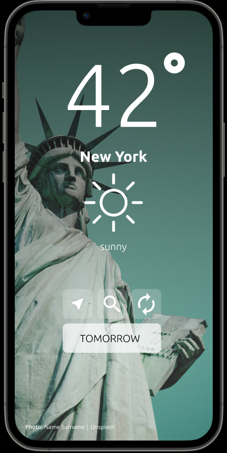
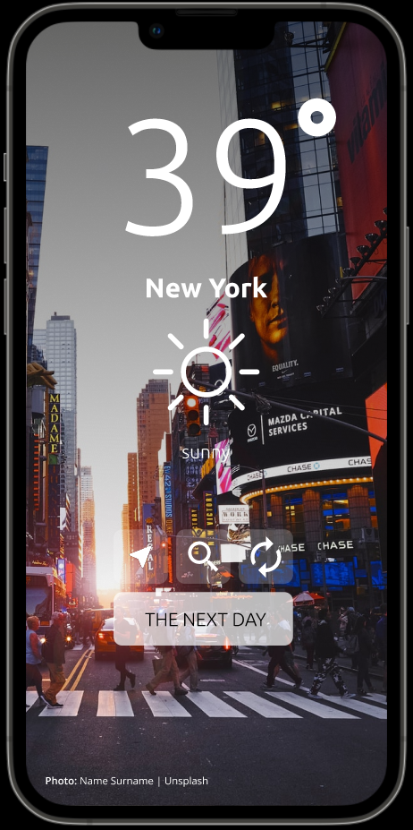
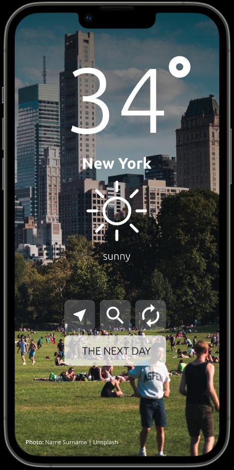
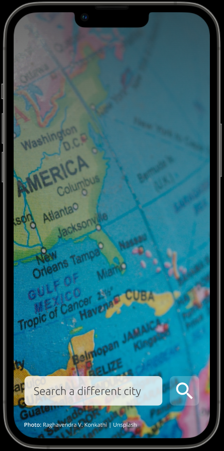

# Personal Weather App

I am interested to see what it would be like to deploy a mobile app to man y platforms.

A location aware, minimalist personal weather checker.

## Design

| 1 | 2 | 3 | 4 |
| ----------- | ----------- | ----------- | ----------- |
|  |  |  |  |

## Resources

### OpenWeather API

[Icons chart](https://openweathermap.org/weather-conditions)
[Icons of weather](https://erikflowers.github.io/weather-icons/)

## Flutter Docs

Inspired by: [Dr. Angela Yu](https://www.udemy.com/course/flutter-bootcamp-with-dart/)

- [online documentation](https://docs.flutter.dev/)
- [Lab: Write your first Flutter app](https://docs.flutter.dev/get-started/codelab)
- [Cookbook: Useful Flutter samples](https://docs.flutter.dev/cookbook)
